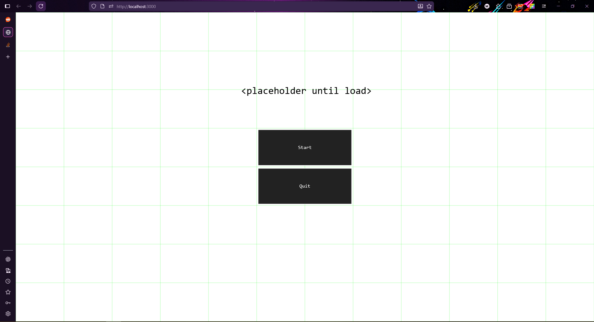

## Game JS

### Current features implemented
- cell based ui
- loads ui from external file



## Example layout used in picture

```
{
    "grid": { "cols": 12, "rows": 8 },
    "elements": [
        {
            "type": "label",
            "text": "<placeholder until load>",
            "state": "game",
            "size": "32px",
            "cell": { "col": 6, "row": 2, "colSpan": 2, "rowSpan": 2}
        },

        {
            "type": "button",
            "text": "Start",
            "state": "game",
            "cell": { "col": 5, "row": 3, "colSpan": 2 },
            "onClick": "startGame"
        },
        {
            "type": "button",
            "text": "Quit",
            "state": "game",
            "cell": { "col": 5, "row": 4, "colSpan": 2 },
            "onClick": "quitGame"
        }
    ]
}
```


## How to use


```
npx server .
```